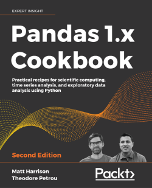

# Data Manipulation and Data Visualization: Introduction to Pandas and Matplotlib

[pandas](https://pandas.pydata.org/) is a powerful, open source Python library for data analysis, manipulation, and visualization. 
[matplotlib](https://matplotlib.org/) is a comprehensive library for creating static, animated, and interactive visualizations in Python.
The goal of the following Jupyter notebooks is to give you some concrete examples for getting started with pandas and matplotlib.

## Jupyter Notebooks

- [DataFrames and Series](https://nbviewer.jupyter.org/github/um-perez-alvaro/Data-Science-Practice/blob/master/Jupyter%20Notebooks/Pandas/notebooks/The%20pandas%20DataFrame.ipynb)
- Working with Series
- Sorting and Filtering
- Applying a function to a DataFrame or Series
- Data Aggregation and and Grouping
- Data Visualization

## Practice Problems

**Set 1 ():**
- Problem 1
- Problem 2

**Set 2 ():**
- Problem 3
- Problem 4
  
**Set 3 ()**
- Problem 5
- Problem 6
  
**Set 4 ()**
- Problem 7
- Problem 8

**Set 5 ()**
- Problem 9
- Problem 10
- Problem 11

## Homework 1 ()

- [Stanford Open Police Dataset](https://nbviewer.org/github/um-perez-alvaro/Data-Science-Practice/blob/master/Jupyter%20Notebooks/Pandas/homework/Homework%20problem%201.ipynb)
- [A visual history of Nobel prize winners](https://nbviewer.org/github/um-perez-alvaro/Data-Science-Practice/blob/master/Jupyter%20Notebooks/Pandas/homework/Homework%20problem%202.ipynb)
- [Analyzing US baby name trends](https://nbviewer.org/github/um-perez-alvaro/Data-Science-Practice/blob/master/Final%20Exam/Part%20I.ipynb)

## Datasets

Filename | Description |  Source
--- | --- |  --- 
[incidents_MT](https://raw.githubusercontent.com/um-perez-alvaro/Data-Science-Practice/master/Data/incidents_MT.csv) | Crime incidents reported in Montana | [Federal Bureau of Investigation - Crime Data Explorer](https://crime-data-explorer.app.cloud.gov/pages/home) 
[traffic crashes](https://data.cityofchicago.org/Transportation/Traffic-Crashes-Crashes/85ca-t3if) | This dataset covers traffic crashes on city streets within Chicago city limits | [Chicago Data Portal](https://data.cityofchicago.org/) 
| [nobel.csv](https://raw.githubusercontent.com/um-perez-alvaro/Data-Science-Practice/master/Data/nobel.csv) | Nobel prize winners | [Kaggle](https://www.kaggle.com/nobelfoundation/nobel-laureates)
[police_ri](https://raw.githubusercontent.com/um-perez-alvaro/Data-Science-Practice/master/Data/police_ri.csv) | Data on vehicle and pedestrian stops from law enforcement departments across Rhode Island | [Stanford Open Policing Project](https://openpolicing.stanford.edu/data/)
[sales](https://raw.githubusercontent.com/um-perez-alvaro/Data-Science-Practice/master/Data/sales.csv) | Monthly Sales Data of sell of electronics equipment across USA in 2019 | [Kaggle](https://www.kaggle.com/subhendughosh/monthly-sales-data)
[Fremont](https://raw.githubusercontent.com/um-perez-alvaro/Data-Science-Practice/master/Data/Fremont.csv) | Fremont bridge bicycle counter | [City of Seattle Open Data portal](https://data.seattle.gov/)
[drinks](https://raw.githubusercontent.com/um-perez-alvaro/Data-Science-Practice/master/Data/drinks.csv) | Alcohol consumption by country | [FiveThirtyEight](https://github.com/fivethirtyeight/data/tree/master/alcohol-consumption) 
[imdb_1000](https://raw.githubusercontent.com/um-perez-alvaro/Data-Science-Practice/master/Data/imdb_1000.csv) | Top rated movies from IMDb  | [IMDb](http://www.imdb.com/search/title?groups=top_1000&sort=user_rating&view=simple) 
[titanic](https://raw.githubusercontent.com/um-perez-alvaro/Data-Science-Practice/master/Data/titanic.csv) | Famous Titanic daseset from Kaggle | [Kaggle](https://www.kaggle.com/c/titanic)
[ufo](https://raw.githubusercontent.com/um-perez-alvaro/Data-Science-Practice/master/Data/ufo.csv) | Reports of UFO sightings from 1930-2000 (the truth is out there)  | [National UFO Reporting Center](http://www.nuforc.org/webreports.html)
[chipotleorders](https://raw.githubusercontent.com/um-perez-alvaro/Data-Science-Practice/master/Data/chipotleorders.csv) | Online orders from the Chipotle restaurant chain ([link](https://www.nytimes.com/interactive/2015/02/17/upshot/what-do-people-actually-order-at-chipotle.html) to The Upshot article)| [TheUpshot](https://github.com/TheUpshot/chipotle)
[advertising](https://raw.githubusercontent.com/um-perez-alvaro/Data-Science-Practice/master/Data/Advertising.csv) | Sales info in 200 different markets, along with advertising budgets for three different media: TV, radio, and newspaper | [An Introduction to Statistical Learning](http://faculty.marshall.usc.edu/gareth-james/ISL/index.html)
[tips](https://raw.githubusercontent.com/um-perez-alvaro/Data-Science-Practice/master/Data/tips.csv) | Restaurant tipping | [Python for Data Analysis](https://learning.oreilly.com/library/view/python-for-data/9781449323592/)
[movies](https://raw.githubusercontent.com/um-perez-alvaro/Data-Science-Practice/master/Data/movies.csv) | Movies | [IMDb](http://www.imdb.com/search/title?groups=top_1000&sort=user_rating&view=simple)
[users](https://raw.githubusercontent.com/um-perez-alvaro/Data-Science-Practice/master/Data/users.csv) | Demographic information about MovieLens users | [MovieLens](https://movielens.org/)
[euro12](https://raw.githubusercontent.com/um-perez-alvaro/Data-Science-Practice/master/Data/euro12.csv) | 2012 UEFA European Football Championship data | [GitHub](https://github.com/guipsamora/pandas_exercises)
[US_Crime_Rates](https://raw.githubusercontent.com/um-perez-alvaro/Data-Science-Practice/master/Data/US_Crime_Rates.csv) | US crime rates (1964-2014) | [www.disastercenter.com](www.disastercenter.com)
[greenhouse_emissions](https://raw.githubusercontent.com/um-perez-alvaro/Data-Science-Practice/master/Data/greenhouse_emissions.csv) | Inventory of U.S. Greenhouse Gas Emissions | [United States Environmental Protection Agency](https://www.epa.gov/ghgemissions/inventory-us-greenhouse-gas-emissions-and-sinks)
[energy_production](https://raw.githubusercontent.com/um-perez-alvaro/Data-Science-Practice/master/Data/energy_production.csv) | US energy production in quads by sector | [US Energy Information Administration](https://www.eia.gov/totalenergy/)
[mso_daily_temp](https://raw.githubusercontent.com/um-perez-alvaro/Data-Science-Practice/master/Data/mso_daily_temp.csv) | Max and min daily temperature in Missoula for the time periods 1950-1959 and 2010-2019 | [NOAA](https://www.ncei.noaa.gov/cdo-web/) 
[mso_monthly_temp](https://raw.githubusercontent.com/um-perez-alvaro/Data-Science-Practice/master/Data/mso_monthly_temp.csv) | Monthly average temperatures in Missoula county | [NOAA](https://www.ncei.noaa.gov/access/monitoring/climate-at-a-glance/)
[emergency_events](https://raw.githubusercontent.com/um-perez-alvaro/Data-Science-Practice/master/Data/emergency_events.csv) |  Emergency Events database covering over 20,000 mass disasters globally, starting from 1900 | [KU Leuven](https://public.emdat.be/)
[world_population](https://raw.githubusercontent.com/um-perez-alvaro/Data-Science-Practice/master/Data/world_population.csv) | World population (1900--2022) | [Our World in Data](https://ourworldindata.org/)

## Would You Like to Know More?

These are three excellent books for learning Pandas:

- [Python for Data Analysis (2nd edition)](https://www.oreilly.com/library/view/python-for-data/9781491957653/)
- [Python Data Science Handbook](https://jakevdp.github.io/PythonDataScienceHandbook/) (full text available)
- [Pandas 1.x Cookbook (2nd edition)](https://www.packtpub.com/product/pandas-1-x-cookbook-second-edition/9781839213106)

<table><tr>
<td>  </td>
<td>  </td>
<td>  </td>
</tr></table>
