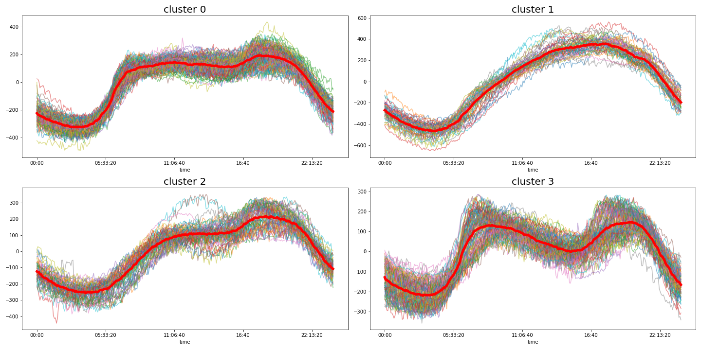

# Data Science Analytics

This is the GitHub repository of Data Science Analytics (M461)/Advanced Analytics (M561)

## Contents:

- [Data Manipulation and Data Visualization](https://github.com/um-perez-alvaro/Data-Science-Practice/blob/master/Jupyter%20Notebooks/Pandas/README.md)
- Classification Problems
- Regression
- Trees, Ensemble Methods and Random Forests
- Naive Bayes and Text Classification
- Clustering and Segmentation
- 
## Extra Topics:

- Deep Learning (for Natural Language Processing, Image Classification and Computer Vision)
- Processing Massively Large Data Sets: Sequential, Parallel, and Distributed Computing

